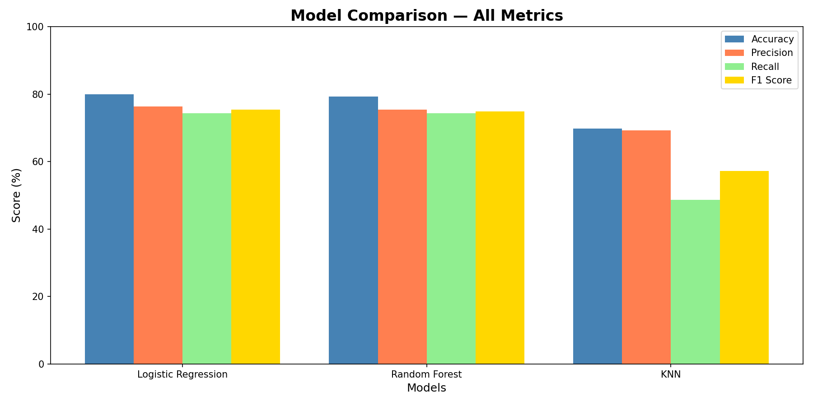
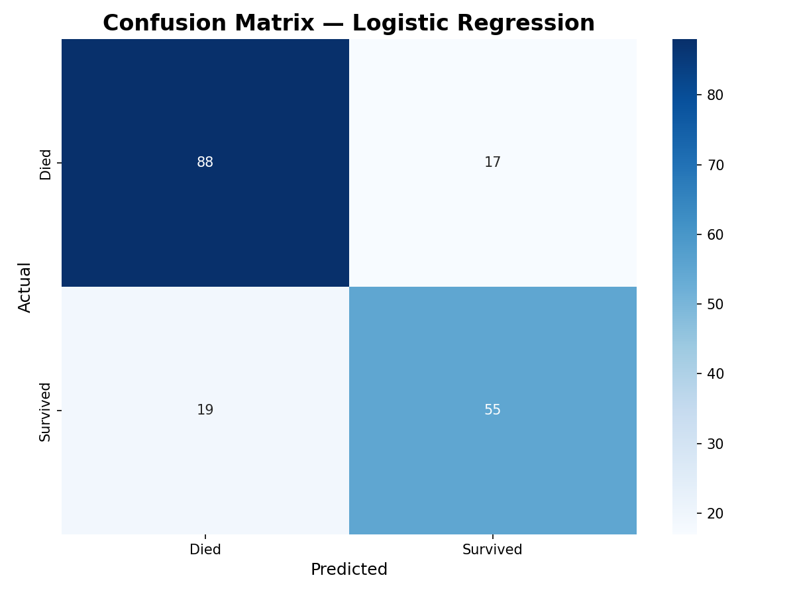

# Titanic Survival Prediction
## Pluto Academy AI & ML Internship — Project 2

---

## 📌 Project Overview
Built, trained, and evaluated 3 Machine Learning models to predict 
which passengers survived the Titanic disaster based on features 
like gender, age, class, and fare.

---

## 🛠️ Tools Used
- **Python** (Pandas, NumPy, Scikit-learn, Matplotlib, Seaborn)
- **Google Colab**

---

## 📁 Dataset
- Source: Titanic — Machine Learning from Disaster (Kaggle)
- Size: 891 passengers | 12 columns
- Link: https://www.kaggle.com/c/titanic

---

## 🎯 Problem Type
Binary Classification — Predict Survived (0=Died, 1=Survived)

---

## ⚙️ Preprocessing Steps
- Dropped irrelevant columns (Name, Ticket, Cabin, PassengerId)
- Filled missing Age with median value
- Filled missing Embarked with mode
- Encoded Sex column (Male=0, Female=1)
- Applied One-Hot Encoding on Embarked column
- Dropped weak features (SibSp, Parch, Embarked_Q)
- Split data 80% Train / 20% Test

---

## 📊 Model Comparison

| Model | Accuracy | Precision | Recall | F1 Score |
|-------|----------|-----------|--------|----------|
| **Logistic Regression** | **79.89%** | **76.39%** | **74.32%** | **75.34%** |
| Random Forest | 79.33% | 75.34% | 74.32% | 74.83% |
| KNN | 69.83% | 69.23% | 48.65% | 57.14% |

---

## 🏆 Best Model — Logistic Regression
- Highest Accuracy: **79.89%**
- Highest F1 Score: **75.34%**
- Most interpretable model
- Best suited for binary classification

---

## 🔍 Key Findings
1. Gender (Sex) is strongest predictor — females survived more
2. Passenger class (Pclass) strongly affects survival
3. Higher fare passengers had better survival chances
4. Logistic Regression outperformed Random Forest and KNN
5. KNN had very low Recall (48.65%) — worst model for this task

---

## 📈 Visualisations

---

## 📂 Files in this Repository
| File | Description |
|------|-------------|
| `AIML_Project2_Titanic_ML.ipynb` | Main ML notebook |
| `train.csv` | Titanic dataset |
| `model_comparison.png` | Model comparison chart |
| `confusion_matrix.png` | Confusion matrix |

---

## 🔗 Google Colab Notebook
[Click here to view notebook](YOUR_COLAB_LINK_HERE)

---

## 5-Line Conclusion
1. Logistic Regression performed best with 79.89% accuracy and 75.34% F1 Score
2. Random Forest performed similarly but slightly lower at 79.33% accuracy
3. KNN performed worst with only 69.83% accuracy and 48.65% recall
4. Gender was the most important feature — females had much higher survival rate
5. Logistic Regression selected as best model for its accuracy and interpretability
